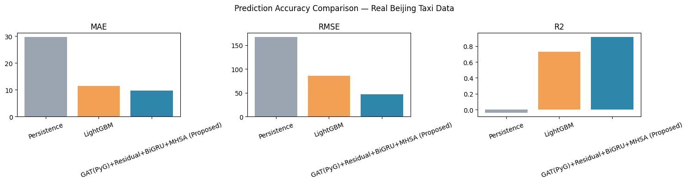

# 🚖 Taxi Route Recommendation System

An AI-powered **spatio-temporal taxi route recommendation system** that combines **Graph Attention Networks (GAT)**, **Transformer-based temporal modeling**, and **LightGBM** to predict passenger demand, estimate road congestion, and recommend profit-optimized taxi routes using real-world taxi trip data. The project also integrates **SHAP Explainable AI** to interpret model predictions.

---

## 🚀 Features

- **Road Network Construction:** Builds a graph representation of the road network from taxi trip data for spatial learning.
- **Demand Prediction:** Uses **Graph Attention Networks (GATConv)** to learn spatial dependencies between connected road segments.
- **Temporal Modeling:** Captures city-wide historical demand trends using a Transformer-based temporal encoder.
- **Hybrid Prediction Pipeline:** Combines graph embeddings, temporal features, and engineered road attributes with **LightGBM** for demand prediction and route scoring.
- **Profit-Optimized Routing:** Recommends routes using a custom **Depth-First Search (DFS)** algorithm that maximizes expected profit.
- **Hyperparameter Optimization:** Uses **Optuna** for automated model tuning.
- **Explainable AI:** Integrates **SHAP** to identify the most influential features affecting demand prediction.
- **Interactive Visualizations:** Generates road networks, traffic heatmaps, and route recommendations using **Folium**.

---

## 💻 Tech Stack

**Languages**
- Python

**Machine Learning & Deep Learning**
- PyTorch
- PyTorch Geometric
- LightGBM
- Scikit-learn
- Optuna

**Data Processing**
- Pandas
- NumPy

**Visualization & Explainability**
- Folium
- Matplotlib
- NetworkX
- SHAP
- Seaborn

---

## 📁 Project Structure

```texts
Taxi-Route-Recommendation-System/
│
├── notebooks/
│   └── Taxi_Route_Recommendation_System.ipynb
│
├── data/
│   └── taxi_route_dataset_sample.csv
│
├── images/
│   ├── architecture.png
│   ├── route_map.png
│   ├── results.png
│   └── shap.png
│
├── requirements.txt
└── README.md
```

---

## 🏗️ Model Architecture

<p align="center">
  
</p>

The proposed hybrid pipeline consists of:

- **Graph Attention Network (GAT)** for learning spatial road connectivity.
- **Transformer-based Temporal Encoder** for modeling historical demand patterns.
- **Feature Fusion Layer** combining spatial, temporal, and engineered features.
- **LightGBM** for final demand prediction and route ranking.

---

## 🚖 Route Recommendation

<p align="center">
  
</p>

The recommendation engine considers:

- Predicted passenger demand
- Traffic congestion
- Historical travel patterns
- Road connectivity
- Expected route profitability

to recommend the most profitable route for a taxi driver.

---

## 📊 Results

<p align="center">
  
</p>

The hybrid model effectively captures both **spatial road relationships** and **temporal demand dynamics**, resulting in accurate demand prediction and intelligent route recommendations.

---

## 🔍 Pickup Probability Heatmap

<p align="center">
  
</p>

---

## ⚙️ Installation

Clone the repository:

```bash
git clone https://github.com/Ishan-debugg/Taxi-Route-Recommendation-System.git
cd Taxi-Route-Recommendation-System
```

Install dependencies:

```bash
pip install -r requirements.txt
```

Launch Jupyter Notebook:

```bash
jupyter notebook
```

Open:

```text
notebooks/Taxi_Route_Recommendation_System.ipynb
```

Run all cells to execute the complete pipeline.

---

## 🌟 Key Highlights

- Graph-based road network representation
- Spatial learning using Graph Attention Networks (GAT)
- Transformer-based temporal demand modeling
- LightGBM route ranking
- Hyperparameter optimization with Optuna
- SHAP-based model explainability
- Interactive route visualization using Folium

---

## 👨‍💻 Author

**Ishan Tarkas**

- GitHub: https://github.com/Ishan-debugg
- LinkedIn: https://www.linkedin.com/in/ishan-tarkas-4381a4281/

---

⭐ If you found this project useful, consider giving it a star!
